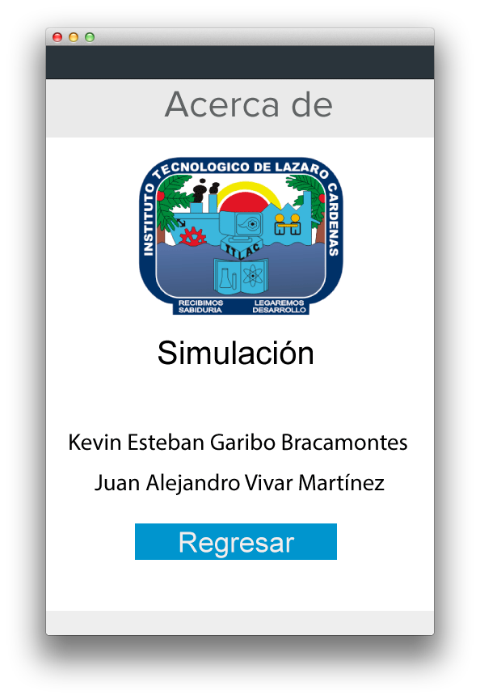

#Simulador de consumo de agua

Este es un proyecto creado en Java para calcular el consumo de agua si vives en la ciudad Lazaro cardenas Michoacan Mexico

+ Menu principal

+ Dashboard

+ Resultado

+ Acerca de

